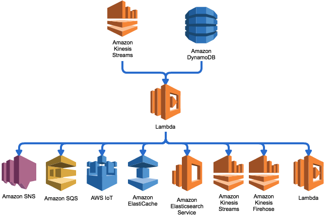

# 在AWS中国区区域部署Lambda Fanout
Kinesis data stream目前不支持跨区域复制，本方案采用Lambda Fanout函数实现了Kinesis data stream从北京区域复制到宁夏区域。
其实fanout还支持Kinesis data stream和DynamoDB异构复制，架构示意图如下：



在AWS 北京区域创建Kinesis data stream ，名称为：source-bjs-kds；宁夏区域创建创建名称为：target-zhy-kds

```

$ git clone https://github.com/comdaze/aws-lambda-fanout-china-region.git
$ cd aws-lambda-fanout-china-region
$ ./fanout deploy --function fanout
$ ./fanout register kinesis --function fanout --source-type kinesis --source-arn arn:aws-cn:kinesis:cn-north-1:456370280007:stream/source-bjs-kds --id bjs-zhy-kineis --destination arn:aws-cn:kinesis:cn-northwest-1:456370280007:stream/target-zhy-kds --destination-region cn-northwest-1 --region cn-north-1 --active true
$ ./fanout hook --function fanout --source-type kinesis --source source-bjs-kds
$ ./fanout list --function fanout --source-type kinesis --source source-bjs-kds
--------------------------------------------------------------
|                            Query                           |
+-----------------+----------+------------------+------------+
|      _1_id      | _2_type  | _3_destination   | _4_active  |
+-----------------+----------+------------------+------------+
|  bjs-zhy-kineis |  kinesis |  target-zhy-kds  |  True      |
+-----------------+----------+------------------+------------+

```
fanout详细用法和命令行帮助，参考[帮助](/help.md)
